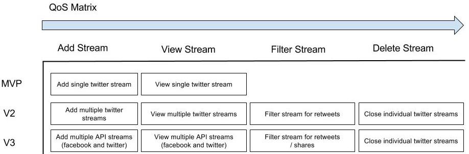

# Hootsuite-streams-clone

A simplified clone of hootsuite's dashboard streams.

### Quality of Service Matrix



### User Stories

MVP:

```
As a User
So I can view my tweet
I want to connect to my twitter feed

As a User
So I can read my last tweet 
I want to view the text from my most recent tweet

As a User
So I can see my last tweet's image
I want to view the image from my most recent tweet

As a User
So I can see my most recent tweets together
I want to view my 5 most recent tweets
```

V2:


```
As a User
So I can view multiple twitter streams
I want to open my twitter streams in parrellel (vertically) in the view

As a User
So I can reduce the the number of twitter feeds in my view
I want the option to delete each view individually

As a User
So I can view my retweeted tweets only
I want to the option to filter my stream by reweets  
```

V3:
